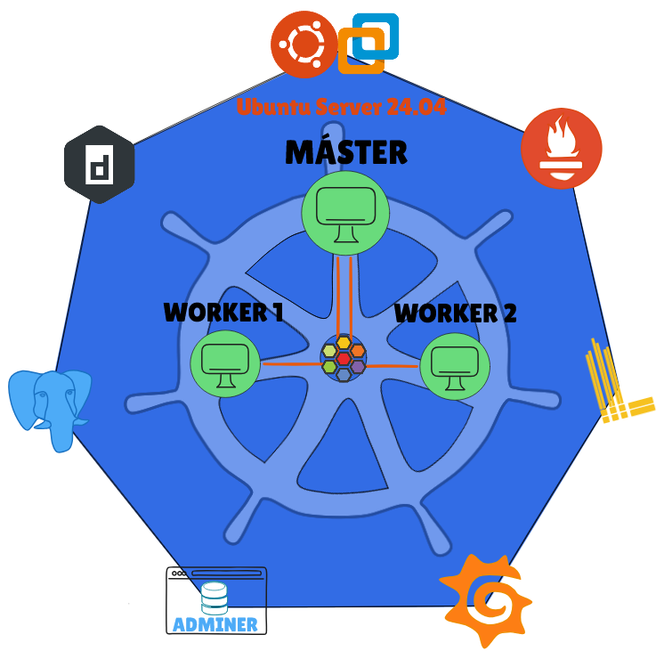

# Monitorizar-Cluster-Kubernetes

## TFG IES QUEVEDO

> En este proyecto haremos un cluster con kubernetes en maquinas virtuales de VMware, 1 **Lubuntu 24.04** como *Nodo Master* y 2 **Ubuntu Server 24.04** como *Nodos Workers*.
>
>> En ellos instalaremos varios servicios pero los que destacan son los de monitorización como **Prometheus** (Para Cluster y Bases de datos), **Grafana** (Para visualizar en dashboards las metricas) y **Loki** (Para hacer una busqueda más a fondo a través de logs). Finalmente la base de datos **PostgreSQL** para comprobar como se comporta el cluster con los datos que añadimos mediante **Adminer** que nos da una interfaz gráfica para hacerlo más sencillo introducir los datos.
>>
> Con este trabajo conseguimos más conocimientos de implantacion de servicios y el entorno en el que se hace y como rinde los servicios en él.
>
> Utilizaremos los [scripts](./SCRIPTS/) *(EJECUTAR LOS SCRIPTS EN OTRA CARPETA)* para automatizar la instalacion del cluster y los servicios.
>
> `bash script.sh` o `./script.sh`
>

---

## ⚙️ Tecnologías utilizadas

- 🖥️ VMware Workstation

- 💻 Lubuntu / Ubuntu Server 24.04

- 🔧 Bash scripts

- 🐳 Kubernetes (con CNI **Cilium**)

- 📦 Helm Chart

- 📈 Prometheus, Grafana

- 📚 Loki + Promtail

- 🐘 PostgreSQL (Bitnami Helm Chart)

- 🧰 Adminer

## 🖥️ Acceder a los servicios

##### `kubectl get svc <NAMESPACE>`

| Servicio     | URL                           |
|--------------|-------------------------------|
| Prometheus   | `http://<IP_NODE>:PUERTO`     |
| Grafana      | `http://<IP_NODE>:PUERTO`     |
| Adminer      | `http://<IP_NODE>:PUERTO`     |

## 📚 Fuentes / Referencias

Para hacer el trabajo me he apoyado en varios tutoriales e informacion acerca del cluster y servicios que se levantan dentro de kubernetes

- [Monitorización con Prometheus, Grafana y Loki](https://medium.com/@ismaelaguilera_/monitorear-cluster-de-kubernetes-con-prometheus-loki-y-grafana-d6ffb620d265)

- [Monitorizar PostgreSQL](https://medium.com/@ozg/monitoring-postgresql-databases-in-kubernetes-using-prometheus-and-grafana-33ed45b213fb)

- [Curso Kubernetes](https://pabpereza.dev/docs/cursos/kubernetes)

- [Documentación oficial Kubernetes](https://kubernetes.io/es/docs/concepts/services-networking/service/)

## 📌 Notas finales

Este repositorio forma parte del Trabajo de Fin de Grado. Todo el entorno fue probado en un clúster real sobre máquinas virtuales.

---